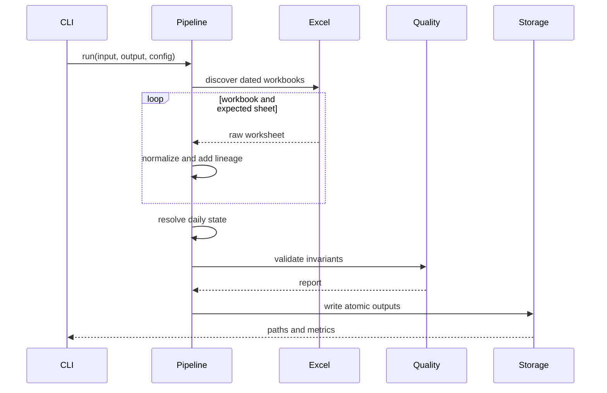

# Architecture

## Objective

Reconstruct the daily state of operational processes from a folder of dated
Excel snapshots without mutating the source files.

## Components

| Module | Responsibility |
| --- | --- |
| `config.py` | Load and validate the versioned TOML contract |
| `ingestion.py` | Discover files, infer dates and read configured worksheets |
| `transform.py` | Normalize, clean, deduplicate, enrich and hash records |
| `quality.py` | Validate output invariants and classify findings |
| `storage.py` | Persist Parquet, formatted Excel, JSON and PostgreSQL |
| `pipeline.py` | Coordinate the complete transaction |
| `cli.py` | Expose reproducible command-line workflows |

## Processing sequence

## Deterministic ordering

Input workbooks are sorted by extracted date, case-insensitive filename and
complete path. Within a daily snapshot, records are ordered by workbook order,
configured worksheet order and original Excel row number. The last appearance
wins when the same process occurs more than once on the same date.

## Lineage model

- `SNAPSHOT_DATE`: business reference date parsed from the filename;
- `SNAPSHOT_ORDER`: deterministic workbook order;
- `SOURCE_FILE`: original filename;
- `SOURCE_SHEET`: canonical worksheet label;
- `SHEET_ORDER`: order in the configured contract;
- `SOURCE_ROW_NUMBER`: original Excel row, including the header offset;
- `RECORD_HASH`: stable 64-bit hash of business fields.

These fields make every final row explainable and support change detection.

## Failure model

- **Errors** break the contract and block publication.
- **Warnings** identify suspicious but processable values.
- **Info** records observations and automatically resolved conditions.

File outputs are written to temporary files in the target directory and then
atomically replaced, avoiding partially named final artifacts.

## Scaling characteristics

The current implementation is appropriate for histories with tens or hundreds
of thousands of rows. For multi-million-row workloads, the same contract can be
applied in batches and persisted incrementally to Parquet partitions or
PostgreSQL.
